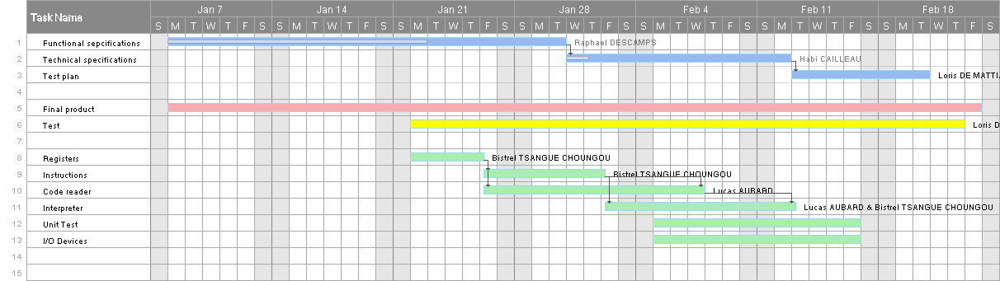
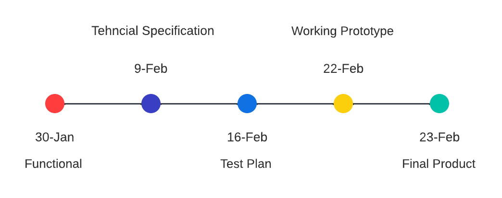

# Functional Specifiactions | Team 6 

<br>
<details>
<summary> Table of Contents </summary>

- [Functional Specifiactions | Team 6](#functional-specifiactions--team-6)
  - [1. Document handling](#1-document-handling)
    - [1.1 Document information](#11-document-information)
    - [1.2 Document Approval](#12-document-approval)
  - [2. Introduction](#2-introduction)
    - [2.1 Glossary](#21-glossary)
    - [2.2 Project Overview](#22-project-overview)
    - [2.3 Project Definition.](#23-project-definition)
      - [2.3.1 Goals of this Project](#231-goals-of-this-project)
      - [2.3.2 Our objectives](#232-our-objectives)
    - [2.4 Project Roles](#24-project-roles)
    - [2.5 Project Plan](#25-project-plan)
      - [2.5.1 Retro Planning](#251-retro-planning)
      - [2.5.2 Milestone](#252-milestone)
      - [2.5.3 Project Constraints](#253-project-constraints)
  - [3. Functional Requirements](#3-functional-requirements)
    - [3.1 Virtual Processor and languages Overview](#31-virtual-processor-and-languages-overview)
      - [3.1.2 Context](#312-context)
      - [3.1.3 Assembly Language](#313-assembly-language)
      - [3.1.4 C Language](#314-c-language)
      - [3.1.3 Our Assembly Language](#313-our-assembly-language)
      - [3.1.4 Characteristic Syntax](#314-characteristic-syntax)
    - [3.2 Virtual processor](#32-virtual-processor)
      - [3.2.1 Instruction Set](#321-instruction-set)
      - [3.2.2 Register](#322-register)
      - [3.2.3 Instruction Execution](#323-instruction-execution)
      - [3.2.4 Memory](#324-memory)
      - [3.2.5 Interrupts](#325-interrupts)
    - [3.3 Assembler Interpreter](#33-assembler-interpreter)
      - [3.3.1 Syntax Analysis](#331-syntax-analysis)
      - [3.3.2 Execution](#332-execution)
      - [3.3.3 Error Handling](#333-error-handling)
    - [3.4 User Interface](#34-user-interface)
      - [3.4.1 Assembly Language Program Input](#341-assembly-language-program-input)
      - [3.4.2 Runtime Display](#342-runtime-display)
      - [3.4.3 Error Handling](#343-error-handling)
  - [4. Non-Functional Requirement](#4-non-functional-requirement)
    - [4.1 Portability](#41-portability)
    - [4.2 Maintenance](#42-maintenance)
    - [4.3 Ease of Use](#43-ease-of-use)
  - [5. Conclusion](#5-conclusion)

</details>
</br>

---
## 1. Document handling 

### 1.1 Document information 

| Document Type | Specification |
|---|---|
| Document Owner | Raphaël Descamps |
| Issue date | 30/01/2024 |
| Document Name | Functional-Specification|


### 1.2 Document Approval

| Role | Name | Signature | Date |
|---|---|---|---|
| Project Manager | Michel Riff | ✅ | 30/01/2024 |
| Program Manager | Raphaël Descamps| ✅ |30/01/2024 |
| Tech Lead | Habi Cailleau | ✅ | 30/01/2024 |
| Software Developer | Lucas Aubard | ✅ | 30/01/2024 |
| Software Developer | Vivien Bistrel Tsangue |✅ | 30/01/2024|
| Quality Assurance | Loris De Mattia Segalat | ✅ | 30/01/2024 |


## 2. Introduction

### 2.1 Glossary

| Term used | Definition |
|---|---|
| "Team" | ALGOSUP team 6 (2023-2024 - Project 3) |
| "Language" | A set of symbols and rules for instructing computers. | 
| "Assembly" | Low-level language for direct processor programming. |
| "C" | The C language is a high-level, efficient and portable programming language, originally developed for UNIX. |
| "Virtual Processor" | The term "virtual processor" refers to a simulated processing unit in a virtualized computing environment. |
| "IDE" | An IDE (Integrated Development Environment) combines code editing, compilation, and debugging tools in a single interface for efficient development. |
| "GCC" | GCC, or GNU Compiler Collection, is a set of open-source compilers for various languages, providing cross-platform compatibility and code optimization. |
| "Register"     | A small, fast storage location in the CPU for temporary data and quick operations. |
| "Label"        | A symbolic name in code used to mark positions, often the target of jumps or branches. |
| "Interpreter"  | A program that directly executes code without prior compilation, translating and executing it line by line. |
| "IP" | Instruction Pointer, a register that holds the memory address of the next instruction to be executed. |
| "SP" | Stack Pointer, a register that holds the memory address of the top of the stack. |
| "LR" | Link Register, a register used to store the return address when calling subroutines or functions. |
| "PC" | Program Counter, a register that holds the memory address of the current instruction being executed. |

### 2.2 Project Overview 

Our team was tasked with creating a virtual processor and an interpreter for running and interpreting assembly code on that virtual processor. Additionally, we were tasked with creating a virtual system to observe the assembly program actually running, and displaying text in a virtual terminal that can be accessed from the assembly code.

### 2.3 Project Definition. 

The project involves creating a virtual processor and an interpreter to run and interpret assembly code. The development will be in plain, portable C language, utilizing only C standard libraries and avoiding external libraries. The recommended tools include using GCC as a compiler and Visual Studio Code as the IDE.

#### 2.3.1 Goals of this Project
    
The primary goal of our team for this project is to conduct a meeting with team members to devise assembly instructions and discuss their implementation.

Secondly, we need to document all aspects, including the functional specification and technical specification. We also need to delve into the various phases of the project.

Thirdly, we will enter the implementation phase of the project.

Fourthly, we have to test all the different functions of the implemented code and compare the results with the desired outcomes.

Finally, we must ensure that the code works properly and deliver the project on time.

####  2.3.2 Our objectives
    
<b>Assembly Language Support:</b>

Develop a virtual processor that supports a simple assembly language, with a focus on essential instructions commonly used in low-level programming.

<b>Interpreter: </b>

The interpreter will return error messages discovered during execution. For example, if there is an error at the 'add: R1' level, we will receive an error message, indicating that there is an issue. In this case, the error message will specify the line where the error occurred, pointing out that there is an error since we only have a single register, which is the destination register.

<b>Execution Accuracy:</b>

Ensure that the virtual processor accurately interprets and executes assembly language instructions, maintaining compatibility with established conventions and standards.

<b>User Interface:</b>

Implement a virtual system to facilitate user interaction, enabling the loading and execution of assembly programs. The virtual system should provide relevant information about the assembly, ensuring a user-friendly and informative experience.

<b> Architecture: </b>

To implement our assembly code, we will draw inspiration from the ARM 16-bit architecture and the LC3 architecture, both of which are 16-bit and closely similar in their implementation.

<b>Register and Memory Management:</b>

Design the virtual processor to effectively manage registers for temporary data storage and intermediate results in 16 bits. Implement functionalities for storing and loading, jumping, calling, copying, computing operations, and comparing program instructions and data.

<b>Interrupt Handling:</b>

Implement a mechanism for handling interruptions, encompassing both software and hardware interruptions. The virtual processor should respond appropriately to interrupt signals.

<b>Performance and Portability:</b>

Achieve acceptable performance for the execution of moderate-sized assembly programs. Ensure the source code's portability to guarantee compatibility with various operating systems.

<b>Security Measures:</b>

Incorporate security measures to prevent buffer overflow attacks and ensure the secure execution of programs. Implement proper isolation between different executing processes to enhance system security.

### 2.4 Project Roles 

As defined by the project owner (ALGOSUP), the team is organized in the following way :

| Role | Description | Name |
|---|---|---|
| Project Manager | Is in charge of organization, planing and budgeting.<br>Keep the team motivated.  | Michel Riff |
| Program Manager | Makes sure the project meets expectation.<br>Is in charge of design.<br>Is responsible for writing the Functional Specifications | Raphaël Descamps |
| Tech Lead | Makes the technical decision in the project.<br>Translates the Functional Specification into Technical Specifications.<br> Does code review. | Habi Cailleau |
| Software Engineer | Writes the code.<br>Writes documentation<br>Participate in the technical design. | Lucas Aubard |
| Software Engineer | Writes the code.<br>Writes documentation<br>Participate in the technical  | Vivien Bistrel Tsangue |
| Quality Assurance |  Tests all the functionalities of a product to find bugs and issue.<br>Document bugs and issues.<br>Write the test plan.<br>Check that issues have been fixed.| Loris De Mattia Segalata |

### 2.5 Project Plan 

#### 2.5.1 Retro Planning  


 
#### 2.5.2 Milestone   



<br></br>

#### 2.5.3 Project Constraints

| Constraints |
|---|
| We have to code in C. |
| We can't use any external library beside C standard libraries. |
| We have to create an assembly with basic instructions. |
|Avoid using x86 architecture instruction |

<br></br> 

## 3. Functional Requirements 

### 3.1 Virtual Processor and languages Overview 

#### 3.1.2 Context  

The concept of creating a virtual processor traces its origins back to the early days of computing when researchers and developers sought ways to simulate the behavior of a real processor in a controlled environment. Initial emulations of processors were developed to test software on various hardware architectures without requiring physical access to each type of processor.

The demand for virtual processors became more significant with the evolution of computer architectures and the emergence of distributed systems, virtual machines, and isolated execution environments.


#### 3.1.3 Assembly Language  

Assembly language, often referred to as assembly code, is a low-level language specific to a particular hardware architecture. Each assembly language instruction typically corresponds to a machine instruction, facilitating direct programming of the processor. Programmers use assembly language to write more efficient programs by fully leveraging the hardware's capabilities.

However, learning and maintaining assembly language can be challenging due to its close connection to the underlying hardware architecture. Nevertheless, it provides precise control over the hardware, making it essential for developing embedded systems, device drivers, and other low-level software.

#### 3.1.4 C Language  

The C language, created by Dennis Ritchie in the early 1970s, is a higher-level programming language compared to assembly language. It provides a higher level of abstraction from the hardware, allowing programmers to write portable and easily understandable code while maintaining efficiency close to that of assembly language.

C is an imperative and procedural language, offering features such as memory management through pointers, bit manipulation, and the ability to code critical portions in assembly language for fine optimization.

#### 3.1.3 Our Assembly Language 

| Instruction | Objective | 
|---|---|
| **"ADD"** | Takes two numbers, adds them together and stores the result in a register. |
| **"SUB"** |Subtracts the second number from the first and stores the result in a register.|
| **"DIV"** |Divides the first number by the second and stores the result in a register.|
| **"MUL"** |Multiplies two numbers and stores the result in a register.|
| **"CPY"** |Copies the value from one register to another.|
| **"CMP"** |Compares two numbers and sets flags in the status register based on the result.|
| **"OR"** | Performs a bitwise OR operation on two numbers and stores the result in a register.|
| **"XOR"** |Performs a bitwise XOR operation on two numbers and stores the result in a register.|
| **"JMP"** |Jumps to a specified memory address or label.|
| **"NOT"** |Performs a bitwise NOR operation on two numbers and stores the result in a register.|
| **"LOAD"** | Loads a value from memory into a register.|
| **"STORE"** |Stores the value from a register into memory.|
| **"JE"** |Jumps to a specified memory address or label if the result of the last comparison was equal.|
| **"CALL"** |Calls a subroutine or function at a specified memory address.| 
| **"RET"** | Returns from a subroutine or function.|
| **"AND"** | Performs a bitwise AND operation on two numbers and stores the result. |

Above are all the instructions that our assembly language will be composed of. These are the basic instructions of the normal assembler. 

#### 3.1.4 Characteristic Syntax 

Here is an example of what should be entered in the command prompt of our virtual processor to execute one or more instructions:

**ADD: R1, 1 , 4**

"ADD" = Instruction

R1 = Register number 1

1 = value 1

2 = value 2

Instruction Objective = Add 1 to 2, then store the result in the register named R1. 


### 3.2 Virtual processor

#### 3.2.1 Instruction Set

As described in the table above in section 3.1.3, we have decided to select the basic instructions of the assembly language to avoid confusion. Furthermore, the chosen instructions are those that allow for arithmetic operations, logical maneuvers, and instructions to move data in and out of memory. Essentially, everything fundamental for a processor to perform its tasks.

#### 3.2.2 Register

Our processor needs a set of internal registers to keep things organized during computation. Let’s outline the purpose and limits of each register, like a choreography for our processor dance.

Our virtual processor will be based on 16 bits, so we’ll have a total of 16 registers ranging from R1 to R12. Additionally, we will have specific registers such as R_IP (Intra-Procedure-call scratch register), R_SP (Stack Pointer), R_LR (Link Register), and R_PC (Program Counter). 

#### 3.2.3 Instruction Execution

Imagine each assembly instruction as a script. We need to decide how our virtual processor reads, understands, and acts upon these scripts. So, let’s outline the steps for fetching, decoding, and executing each instruction. It's like teaching our processor a well-rehearsed routine.

#### 3.2.4 Memory

Our processor needs a memory system – a mental
space to store data and instructions. Let's sketch
out how this memory works: the addressing method,
its size, and the steps for loading and storing
data. It's like building a mental filing cabinet
for our processor's thoughts. 

#### 3.2.5 Interrupts

Sometimes our processor needs to take a break for
important tasks – that's where interrupts come in.
Let's design a system for managing these
interruptions, deciding their types, priority, and
how our processor responds when it gets a tap on
the virtual shoulder.

### 3.3 Assembler Interpreter

The assembler interpreter is responsible for analyzing and executing programs written in assembly language intended for the virtual processor. It ensures that the program adheres to the syntax and semantics defined in Section 3.2.5 and provides an efficient execution mechanism.

#### 3.3.1 Syntax Analysis

The interpreter begins by analyzing the assembly language program provided by the user. It follows the defined syntactic rules and tokenizes the program by breaking it down into individual instructions, operands, and labels. The analysis process identifies the type of each instruction and validates the correct use of operands.

#### 3.3.2 Execution

Once the assembly language program is analyzed, the interpreter enters the execution phase. It iterates through each instruction, performs the specified operation, and updates the state of the virtual processor accordingly. The execution includes the following key steps:

- **Loading Immediate Values:**
  - The interpreter handles instructions involving the loading of immediate values into registers.

  ```assembly
  LOAD: R1, 42    ; Loads the immediate value 42 into register R1
  ```

- **Operations on Registers:**
  - Instructions to copy values between registers and perform arithmetic or logical operations are executed.

  ```assembly
  ADD: R2, R1, R3 ; Adds the values in registers R1 and R2 and stores the result in R3
  ```

- **Memory Access:**
  - The interpreter reads from or writes to memory addresses based on the contents of registers.

  ```assembly
  LD R4, [R2]    ; Loads the value at the memory address specified by R2 into register R4
  ST R3, [R4]    ; Stores the value from register R3 at the memory address specified by R4
  ```

- **Conditional Jumps:**
  - The interpreter handles jumps, whether unconditional or conditional based on comparison results.

  ```assembly
  CMP R3, R4     ; Compares the values in registers R3 and R4
  JE LABEL1      ; Jumps to LABEL1 if the comparison result is equal (JNEQ can be implemented by inverting the condition)
  ```

- **Subroutine Calls and Returns:**
  - The interpreter manages subroutine calls and returns.

  ```assembly
  CALL SUBROUTINE ; Calls a subroutine
  RET            ; Returns from a subroutine
  ```

- **Debugger Integration:**
  - During execution, the interpreter can display debugging information, such as the current instruction, program counter, and register contents.

- **Handling Virtual System Calls:**
  - If a virtual system call is encountered, the interpreter interacts with the virtual terminal or performs the specified action.

#### 3.3.3 Error Handling

The interpreter includes robust error-handling mechanisms to detect and report syntax errors, semantic errors, or runtime errors during program execution. Clear error messages and informative feedback assist users in identifying and resolving issues in their assembly language programs.

### 3.4 User Interface

The user interface for the virtual processor system consists of both the assembly language program input and the runtime display of information during program execution. The goal is to provide a seamless and informative experience for users interacting with the system.

#### 3.4.1 Assembly Language Program Input

Users interact with the virtual processor system by providing assembly language programs through text files. The format of these files follows the specifications outlined in section 3.2, adhering to the defined assembly language syntax. To facilitate ease of use, consider providing a sample template or guidelines for creating assembly programs.

#### 3.4.2 Runtime Display

During the execution of an assembly program, the virtual processor system provides real-time information to the user, aiding in debugging and understanding the program flow. The following elements are displayed:

- **Registers:** Display the contents of registers, updating after each instruction execution.
  
  ```
  Registers:
  R1: 42
  R2: 0
  R3: 42
  ...
  ```

- **Memory:** Optionally, display the state of memory, especially when reading or writing to memory addresses.

  ```
  Memory:
  0x00: 42
  0x04: 0
  0x08: 0
  ...
  ```

- **Virtual Terminal Output:** If a virtual system call is implemented for displaying text in a virtual terminal, show the output of the virtual terminal.

  ```
  Virtual Terminal Output:
  Hello, World!
  ```

#### 3.4.3 Error Handling

The user interface should also handle errors gracefully, providing meaningful messages for syntax errors, semantic errors, or runtime errors during program execution. Clear error messages will assist users in identifying and resolving issues in their assembly programs.

## 4. Non-Functional Requirement

### 4.1 Portability

The system must be developed in the C language to ensure maximum portability. It should be compatible with different operating systems, and the use of features specific to any operating system must be avoided.

### 4.2 Maintenance

The source code must be clear, well-commented, and adhere to best coding practices. Comprehensive documentation for future developers must be provided, covering both the system architecture and the specified assembly language.

### 4.3 Ease of Use

The user interface, including program input in assembly language and output during execution, must be user-friendly. Error messages should be explicit and assist users in quickly identifying issues in their code.

## 5. Conclusion

Le développement du processeur virtuel et de son interpréteur en langage d'assemblage constitue une étape cruciale dans la réalisation de ce projet ambitieux. En résumé, nous avons défini un ensemble d'instructions minimaliste pour le langage d'assemblage, établi les fonctionnalités de l'interpréteur en C, et spécifié les exigences fonctionnelles et non-fonctionnelles du système.

La conception modulaire et portable du système permettra son intégration aisée dans divers environnements. Les performances du processeur virtuel seront optimisées tout en garantissant une facilité d'utilisation et une extensibilité maximale.

L'interpréteur sera capable de gérer des programmes écrits dans le langage d'assemblage spécifié, garantissant la validité sémantique et rapportant des erreurs de manière claire et précise. La visualisation en temps réel de l'état du processeur, y compris les registres, la mémoire, et les sorties du terminal virtuel, offrira aux utilisateurs une expérience immersive et informative.

La mise en œuvre de tests unitaires et de programmes de démonstration permettra de valider la fiabilité et la robustesse du système. Une documentation exhaustive accompagnera le code source, facilitant ainsi la maintenance et les futures améliorations du projet.

En conclusion, le projet vise à créer un environnement d'exécution fiable et performant pour des programmes en langage d'assemblage minimaliste. Le respect des exigences énoncées dans ce document garantira le succès du projet, offrant aux utilisateurs une plateforme d'apprentissage, de développement et de test pratique pour le domaine de l'architecture des processeurs et de la programmation bas niveau.