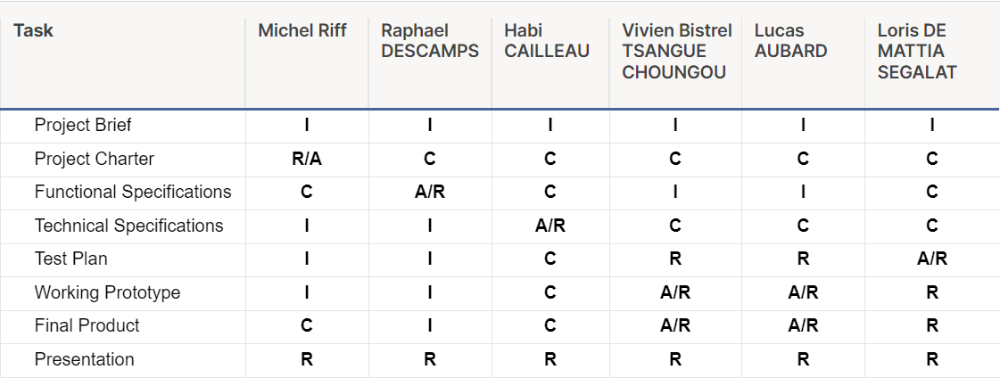

# Project Charter - Virtual Processor - Team n°6

| **Document Name** | Project Charter |
| ---- | ---- |
| **Document Writer** | Michel Riff |
| **Last Update** | 26 January 2024 |
| **Creation Date** | 22 january 2024 |

- - -

## Table of content

- [Project Charter - Virtual Processor - Team n°6](#project-charter---virtual-processor---team-n6)
  - [Table of content](#table-of-content)
    - [Project Overview](#project-overview)
    - [Project Scope](#project-scope)
    - [Stakeholders](#stakeholders)
    - [Team Members](#team-members)
    - [RACI](#raci)
    - [Milestones](#milestones)
    - [Deliverables](#deliverables)

- - -

### Project Overview

This project aims to develop and implement a virtual processor, complete with a specialized interpreter for executing assembly code specifically designed for this processor. The entire project will be constructed using the straightforward and portable C language. Emphasizing portability, the approach will strictly adhere to utilizing only C standard libraries, excluding external libraries from the project.

- - -

### Project Scope

1. Assembly Language Design:
- Devise a minimal assembly language tailored for the virtual processor.
- The instruction set must encompass essential operations, including but not limited to:
    - Storing immediate values into registers.
    - Copying register values.
    - Reading and storing values between registers and memory.
    - Register content comparison.
    - Unconditional and conditional jumps.
    - Subroutine calls and returns.
    - Arithmetic operations: addition, subtraction, multiplication, and division.
    - Logical operations: OR, AND, XOR, and NOT.
Provide a comprehensive description of the assembly language in the functional specification.

2. C Program Development:
- Implement a C program capable of reading a text file containing programs written in the specified assembly language.
- Ensure the C program validates the semantic correctness of the assembly program and detects syntactical errors.
- Describe the intended functionality of the C program in the technical specification.
  
Virtual System Call Implementation:
- Develop a virtual system call for displaying text in a virtual terminal from the assembly code.
- Include functionalities such as displaying register contents.
- The technical specification should detail the workings of the virtual system call.

1. Testing and Validation:
- Create small assembly programs serving as conceptual unit tests to verify the correct functioning of the virtual processor and interpreter.
- Conduct thorough testing to validate the overall integrity of the system.
- Document the testing procedures and results in the project documentation.

- - -

### Stakeholders

| Role | Representative | Expectations |
| ---- | ---- | ---- |
| Client | Mr. Franck Jeannin | The final product |

### Team Members

| Name | Role | Responsabilities |
| ---- | ---- | ---- |
| Michel RIFF | Project Manager | Report to stakeholders Management  Task repartition Risk management |
| Raphael DESCAMPS | Program Manager | Design Communication with client Functional specifications Risk management |
| Habi CAILLEAU | Technical Leader | Choose techincal tools Define interactions within the code Review code Technical specifications |
| Vivien Bistrel TSANGUE CHOUNGOU | Software Engineer | Writing code Fixing bugs Document the code |
| Lucas AUBARD | Software Engineer | Writing code Fixing bugs Document the code |
| Loris DE MATTIA SEGALAT | Quality Assurance | Verify documents Test the program Confirm we match the client needs Overall quality of the project Test plan |

- - -

### RACI

- - -

### Milestones

| Milestone | Due Date |
| ---- | ---- |
| Project Charter | 26 February, 2024 |
| Functional Specifications | 30 January, 2024 |
| Technical Specifications | 9 February, 2024 |
| Test Plan | 16 February, 2024 |
| Final Product | 23 February, 2024 |
| Presentation | 23 February ,2024 |

- - -

### Deliverables
In accordance with the outlined milestones, the project will culminate in the delivery of the following key deliverables:

- Final Product (Main Branch)
- [Functional](./Documents/FunctionalSpecification/FunctionalSpecification.md)
- [Technical](./Documents/TechnicalSpecification/TechnicalSpecification.md)
- Test Plan (QA Branch)
- Weekly Reports and Management Planning (Management Branch)

In conclusion, the project will be officially presented to the client through a concise and informative 15-minute presentation, summarizing the accomplished work and highlighting the key features and functionalities of the virtual processor system.