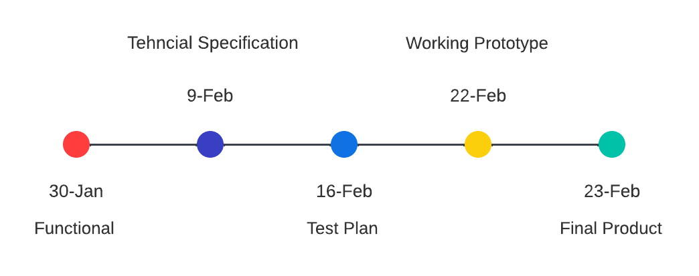

# Functional Specifiactions | Team 6 

---

 

 Table of content 

- [Functional Specifications | Team 6]
(#functional-specifications--team-4)
    - [Table of content](#Table of content)
    

 

---
## 1. Document handling 

### 1.1 Document information 

| Document Type | Specification |
|---|---|
| Document Owner | Raphaël Descamps |
| Issue date | 30/01/2024 |
| Document Name | Functional-Specification|

### 1.2 Document Approval

| Role | Name | Signature | Date |
|---|---|---|---|
| Project Manager | Michelle Riff | ✅ | 30/01/2023 |
| Program Manager | Raphaël Descamps| ✅ |30/01/2023 |
| Tech Lead | Habi Cailleau | ✅ | 11/13/2023 |
| Software Developer | Lucas Aubard | ✅ | 30/01/2023 |
| Software Developer | Vivien Bistrel Tsangue |✅ | 30/01/2023|
| Quality Assurance | Loris De Mattia Segalat | ✅ | 30/01/2023 |

## 2. Introduction

### 2.1 Glossary

| Term used | Definition |
|---|---|
| "Team" | ALGOSUP team 6 (2023-2024 - Project 3) |
| "Assembly" | Low-level language for direct processor programming. |
| "C" | The C language is a high-level, efficient and portable programming language, originally developed for UNIX. |
| "Virtual Processor" | The term "virtual processor" refers to a simulated processing unit in a virtualized computing environment. |

### 2.2 Project Overview 

Our team was tasked with creating a virtual processor and an interpreter for running assembly code on 
that processor.

### 2.2 Goals of this Project
The primary goal of our team for this project is to design, implement, and deliver a virtual processor in the C programming language capable of interpreting and executing assembly language instructions. The virtual processor should emulate key functionalities of a physical processor, including the execution of arithmetic operations, data transfers, jumps, and effective management of registers and virtual memory.

### 2.3 Our objectives

<b>Assembly Language Support:</b>

Develop a virtual processor that supports a specific subset of the assembly language, with a focus on essential instructions commonly used in low-level programming.

<b>Execution Accuracy:</b>

Ensure the virtual processor accurately interprets and executes assembly language instructions, maintaining compatibility with established conventions and standards.

<b>User Interface:</b>

Implement a command-line interface (CLI) to facilitate user interaction, allowing for the loading, execution, and debugging of assembly programs. The CLI should provide relevant information about the processor's state and memory usage.

<b>Register and Memory Management:</b>

Design the virtual processor to effectively manage registers for temporary data storage and intermediate results. Simulate virtual memory to store program instructions and data, with the capability to load and save programs.

<b>Interrupt Handling:</b>

Implement a robust mechanism for handling interruptions, encompassing both software and hardware interruptions. The virtual processor should respond appropriately to interrupt signals.

<b>Performance and Portability:</b>

Achieve acceptable performance for the execution of moderate-sized assembly programs. Ensure the source code's portability, allowing compatibility with various operating systems.

<b>Extensibility:</b>

Design the virtual processor to be extensible, allowing for the straightforward addition of new instructions and features as needed.

<b>Security Measures:</b>

Incorporate security measures to prevent buffer overflow attacks and ensure the secure execution of programs. Ensure proper isolation between different executing processes.

### 2.4 Project Roles 

As defined by the project owner (ALGOSUP), the team is arranged in the following way :

| Role | Description | Name |
|---|---|---|
| Project Manager | Is in charge of organization, planing and budgeting. Keep the team motivated.  | Michel Riff |
| Program Manager | Makes sure the project meets expectation. Is in charge of design. Is responsible for writing the Functional Specifications | Raphaël Descamps |
| Tech Lead | Makes the technical decision in the project. Translates the Functional Specification into Technical Specifications.  Does code review. | Habi Cailleau |
| Software Engineer | Writes the code. Writes documentation Participate in the technical design. | Lucas Aubard |
| Software Engineer | Writes the code. Writes documentation Participate in the technical  | Vivien Bistrel Tsangue |
| Quality Assurance |  Tests all the functionalities of a product to find bugs and issue. Document bugs and issues. Write the test plan. Check that issues have been fixed.| Loris De Mattia Segalata |

  

### 2.5 StakeHolders 

| Stakeholder | Might have/find an interest in... |
|---|---|
| Franck JEANNIN | Having the student learn assembly  |
| ALGOSUP Students | Learning assembly and getting experience |
| B3 | Geting an arcade machnine in the breakroom |

### 2.6 Project Plan 

- Picutre for a retro planning 

Milestone :  

 

## 3 Functional Requirement